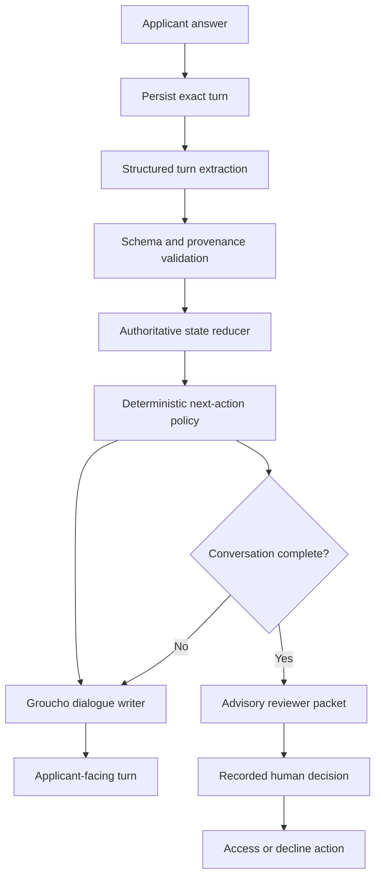

# Groucho stronger V1 implementation plan

> **Status at 20 August 2026:** the conversational-control and human-access-boundary
> slices are implemented and under controlled `/doorcheck` testing. Five positive
> reviewer anchors and four integrity boundaries are encoded. The remaining P0 is a
> broader client-labelled calibration packet and its repeatable evaluation gate. See
> [the current state of play](./groucho-state-of-play-2026-08-20.md).

## Purpose

This plan turns the current Groucho prototype into a coherent, reviewable V1
application system without losing the conversational qualities developed for the
COLORS Forum.

The existing conversation work remains valuable: adaptive applicant branches,
live-thread continuity, response modes, conversational bridges, bounded follow-ups,
neutral closing copy, and evidence-backed reviewer reports should all be retained.
The next stage is to make the application state and decision boundary as reliable as
the conversation feels.

The baseline coherence audit scored the current system **8/22** and marked it **not
ready as an autonomous application decision system**. A stronger V1 should reach at
least the audit's **18/22 strong-foundation range**, with no critical failure
conditions.

## Stronger V1 product boundary

Groucho may:

- interpret what an applicant said;
- identify claims, examples, roles, actions, and unresolved points;
- recommend the next useful conversational action;
- express an approved action in the configured persona;
- assemble an evidence-based advisory reviewer brief.

The application must own:

- exact session history;
- authoritative application state;
- legal state transitions;
- evidence provenance;
- deterministic eligibility rules;
- question and follow-up budgets;
- uncertainty and escalation policy;
- human review status;
- final access or rejection authority.

For COLORS, Groucho remains a presence at the door. It quietly gathers useful
evidence and gives COLORS a reviewable account. It does not make the final community
decision and must not grant access from a model recommendation.

## Non-goals

The stronger V1 does not require:

- a full POMDP or mathematically calibrated information-gain model;
- a graph database;
- a state-machine library when typed reducers and guards are sufficient;
- one model or service per responsibility;
- fine-tuning;
- a larger model by default;
- replacing the current COLORS persona or rebuilding `/doorcheck`;
- exposing phases, evidence, scores, or recommendations to applicants.

## Principles

1. **Applicant statement is not established fact.**
2. **Model inference is not applicant evidence.**
3. **Missing evidence is not negative evidence.**
4. **Writing polish, confidence, status, fame, and familiarity are not evidence quality.**
5. **Questions earn their place by potential decision value, not because a field is empty.**
6. **Subjective cultural judgment belongs to a human.**
7. **Human review is an explicit workflow, not a sentence in a prompt.**
8. **Every recommendation and concern must resolve to source turns.**
9. **Working memory is derived from authoritative records, never authoritative itself.**
10. **Groucho's freedom belongs mainly in expression; state and policy remain bounded.**

## What remains from the current system

| Current capability | V1 treatment |
| --- | --- |
| Exact transcript in `messages` | Retain as the authoritative conversational record |
| Per-turn metadata | Retain as an event source during migration |
| Artist / curator / enthusiast / hybrid routing | Retain as a revisable routing hypothesis, not assessment evidence by itself |
| Evidence goals and multi-goal coverage | Evolve into criterion assessments backed by evidence record IDs |
| Question and follow-up budgets | Retain per-intent repetition limits and a deterministic emergency loop stop; treat normal conversation length as soft pacing guidance |
| Conversation moves and response modes | Retain; policy chooses the move and dialogue generation chooses the expression |
| Conversation thread and bridges | Retain as working context, not authoritative application memory |
| Reviewer report | Evolve into a source-linked reviewer packet |
| `overall`, `authenticity`, and `cultural_depth` scores | Remove from decision authority; deprecate universal fit scoring |
| Model `pass` / `redirect` / `reject` terminal | Replace with conversation completion plus an advisory recommendation |
| `success_secret` after model pass | Issue only after a recorded human approval |

## Target architecture



This architecture does not imply six model calls. The recommended V1 turn uses:

1. one small structured extraction call;
2. deterministic state reduction and policy selection;
3. one short dialogue-writing call only when generative expression adds value.

Terminal closing copy is deterministic and needs no dialogue-writing call. If two
model calls make active-turn latency unacceptable, dialogue generation can be
selectively templated or cached; state and decision boundaries must not be collapsed
to recover latency.

## Authoritative domain model

The exact naming can change during implementation, but the system needs equivalents
of the following types.

```ts
type ApplicationPhase =
  | "orientation"
  | "motivation"
  | "participation"
  | "evidence"
  | "reciprocity"
  | "confirmation"
  | "ready_for_review"
  | "reviewed"

type EvidenceStatus =
  | "supported"
  | "partially_supported"
  | "unsupported"
  | "uncertain"

type EvidenceRecord = {
  id: string
  criterionKey: string
  claim: string
  evidence: string | null
  personalRole: string | null
  consequence: string | null
  sourceTurnIds: string[]
  source: "applicant_statement" | "model_inference" | "applicant_confirmed"
  status: EvidenceStatus
  relevance: "low" | "medium" | "high"
  unresolvedQuestion: string | null
}

type UncertaintyFactors = {
  missingCoreCriteria: string[]
  claimsWithoutExamples: string[]
  unclearPersonalRoles: string[]
  unresolvedContradictions: string[]
  applicantCorrections: string[]
  unusualEvidence: string[]
  assessmentInstability: string[]
}

type ApplicationState = {
  sessionId: string
  version: number
  phase: ApplicationPhase
  orientation: ParticipantOrientationState
  claims: ClaimRecord[]
  evidence: EvidenceRecord[]
  unresolvedQuestions: UnresolvedQuestion[]
  contradictions: ContradictionRecord[]
  applicantQuestions: ApplicantQuestionRecord[]
  uncertainty: UncertaintyFactors
  recommendationStatus: "not_ready" | "ready" | "generated"
  humanReviewStatus: "not_ready" | "pending" | "approved" | "declined"
}

type NextAction =
  | { type: "clarify_claim"; criterionKey: string; evidenceId: string }
  | { type: "clarify_role"; criterionKey: string; evidenceId: string }
  | { type: "ask_for_example"; criterionKey: string }
  | { type: "explore_consequence"; criterionKey: string; evidenceId: string }
  | { type: "answer_applicant_question"; questionId: string }
  | { type: "check_contradiction"; contradictionId: string }
  | { type: "advance"; criterionKey: string }
  | { type: "complete_for_review" }
  | { type: "safety_stop"; reasonCode: string }
```

Model-generated identifiers are never trusted. The server creates record IDs and
resolves every `sourceTurnId` against the current session before applying a state
event.

## Decision categories

| Category | Owner | Examples |
| --- | --- | --- |
| Hard constraints | Application code | Consent, age where applicable, geography, application window, duplicate handling |
| Evidence criteria | Model-assisted, schema validated | Whether an answer contains an example, personal role, action, judgment, or consequence |
| Cultural judgment | Human reviewer | Whether the evidenced perspective and contribution are right for the current Forum |

The advisory outcomes are:

- `proceed`: evidence is sufficiently complete for a human to consider approval;
- `human_review`: evidence is incomplete, contradictory, unusual, or subjective;
- `do_not_proceed`: reserved for deterministic ineligibility or an explicitly agreed
  safety policy. Subjective cultural doubt must use `human_review`.

None of these outcomes grants access. A separate recorded human decision does that.

## Question-selection policy

The policy engine should generate eligible actions from the current state and rank
them using transparent factors:

```text
priority =
  information value
  + decision relevance
  + conversational continuity
  + urgency of contradiction or safety concern
  - applicant burden
  - repetition cost
  - remaining-budget risk
```

V1 does not need false numerical precision. Each factor can initially be
`low | medium | high`, followed by stable tie-break rules.

The selected question must:

- have the potential to change the reviewer packet;
- target an unresolved, relevant criterion;
- respect the applicant's evidenced orientation;
- stay within question and follow-up budgets;
- avoid repeating established evidence;
- yield to an applicant question or correction when appropriate;
- stop when remaining gaps would not materially affect review.

Conversational continuity influences how two similarly valuable actions are ranked.
It must not make a low-value question more important than an unresolved core issue.

## Evidence anchors for COLORS

These anchors are starting points for client calibration, not final acceptance rules.

| Branch | Criterion | Behavioural evidence |
| --- | --- | --- |
| Shared | Motivation | Can explain what they seek beyond access, promotion, or passive consumption |
| Shared | Reciprocity | Can describe both what they hope to receive and how they might participate |
| Shared | Cultural attention | Gives a particular observation about work rather than relying on prestige or familiarity |
| Artist | Practice | Describes what they make, a real choice in the work, or what they are trying to express |
| Artist | Exchange | Identifies a concrete exchange with artists or listeners that would help their practice or others |
| Curator | Personal role | Explains what they personally select, organise, introduce, host, document, or connect |
| Curator | Sustained action | Provides a concrete example of repeated or meaningful participation |
| Curator | Judgment and care | Explains how they handle context, disagreement, responsibility, or work outside their taste |
| Enthusiast | Community meaning | Explains what makes listening or discussion feel shared and worthwhile |
| Enthusiast | Participation | Gives a realistic way they would notice, discuss, share, welcome, or return |
| Hybrid | Relevant combination | Supplies evidence for more than one role without being required to prove every branch |

Scale is contextual. Follower counts, known organisations, audience size, fluency,
professional vocabulary, and recognisable references do not increase evidence status.

## Delivery sequence

### Phase 0 — Enforce the human decision boundary

**Priority:** P0. This precedes further client expansion.

**Implementation status — 20 August 2026:** The first compatibility-safe boundary
slice is implemented. Gatekeeper completion no longer creates a success secret;
`reviewStatus` distinguishes conversation readiness from human approval; an
immutable, reviewer-attributed `application_decisions` record owns approval or
decline; and both access routes require the secret created by an approved human
decision. Legacy `passed`, `redirected`, and `rejected` session values remain
readable as advisory conversation outcomes during migration. Lifecycle renaming,
separate decision webhooks, and removal of final-looking legacy labels remain in
this phase.

Implement:

- replace model-controlled session `pass` and `reject` with conversation lifecycle
  states such as `active`, `ready_for_review`, and `closed`;
- persist advisory recommendation separately from final decision;
- stop generating `success_secret` from a model terminal or score threshold;
- make access endpoints require a recorded human approval;
- add a human-decision record with reviewer ID, decision, reason, and timestamp;
- emit separate `application.ready_for_review` and
  `application.decision_recorded` events;
- retain a compatibility mapping for existing SDK clients during migration.

Acceptance criteria:

- no model field or score can grant eligibility;
- no model field can create an applicant-facing rejection;
- every access grant resolves to a human-decision record;
- existing completed sessions remain readable;
- applicant-facing closing copy remains neutral and unchanged.

### Phase 1 — Add authoritative application state and provenance

Implement:

- a versioned application-state snapshot per session;
- append-only application state events;
- server-created evidence, claim, contradiction, and unresolved-question IDs;
- source-turn references for every evidence item and concern;
- a deterministic reducer that rebuilds current state from events;
- migration from tagged message metadata for active compatible sessions;
- removal of the current-session untagged-answer escape from compact mode;
- explicit applicant correction events.

Recommended persistence shape:

- `session_application_state`: current versioned JSON snapshot for fast reads;
- `application_events`: append-only state transitions with source message IDs;
- retain `messages` as the exact transcript.

Acceptance criteria:

- current state can be rebuilt without asking a model to reinterpret the transcript;
- every state change is traceable to a message or system action;
- refresh and resume preserve phase, evidence, and unresolved questions;
- a malformed or untagged turn cannot silently disable state safeguards;
- applicant corrections supersede earlier claims without deleting history.

### Phase 2 — Replace coverage booleans with criterion evidence

Implement:

- claim, example, personal-role, and consequence extraction;
- `supported`, `partially_supported`, `unsupported`, and `uncertain` criterion states;
- branch-specific COLORS evidence anchors;
- explicit distinction between applicant statement and model inference;
- missing-information records that remain neutral;
- contradiction detection and confirmation routes;
- deterministic validation that cited turns belong to the session.

Acceptance criteria:

- “I am active in my local scene” remains a claim until an example is supplied;
- an example without a clear personal role can trigger one role clarification;
- outcomes are not demanded when inappropriate to the criterion;
- an unsupported claim cannot become positive evidence through confident wording;
- evidence is assessed criterion by criterion, never through a universal fit score.

### Phase 3 — Introduce semantic phases and a next-action policy

Implement:

- semantic phase transitions for orientation, motivation, participation, evidence,
  reciprocity, confirmation, and review readiness;
- legal transition guards;
- an eligible-action generator;
- transparent action ranking using information value, relevance, continuity, burden,
  repetition, and budget risk;
- explicit handling for applicant questions, refusals, corrections, contradictions,
  and pauses;
- deterministic sufficiency and stopping rules;
- configurable escalation conditions.

Acceptance criteria:

- a required phase cannot be skipped solely because the model asks to finish;
- the system can explain privately why the selected action outranked alternatives;
- a question is not asked merely because a field is empty;
- sufficient evidence stops further probing before the emergency loop stop;
- pause and resume return to the correct phase;
- applicant questions can be answered without losing the application state.

### Phase 4 — Separate extraction, policy, and dialogue generation

Implement:

- a narrow structured `extract_application_turn` contract;
- server validation and state reduction before next-action selection;
- a dialogue writer that receives an approved `NextAction`, relevant evidence, recent
  turns, and persona constraints;
- deterministic fallbacks for every action type;
- removal of authoritative terminal, score, coverage, and next-signal fields from
  applicant-facing generation;
- latency instrumentation for extraction, policy, and dialogue stages.

Acceptance criteria:

- dialogue generation cannot alter application state or decision status;
- changing Groucho's wording cannot change the selected criterion or action;
- invalid extraction output produces a safe retry or human-review path;
- terminal closing needs no model call;
- p50 and p95 latency are measured before deciding whether to template more replies.

### Phase 5 — Build the reviewer packet and human workflow

Implement:

- advisory outcome and observable uncertainty factors;
- strongest signals with cited evidence IDs;
- applicant personal role and potential contribution;
- missing information and contradictions;
- deterministic eligibility concerns;
- suggested human follow-up;
- links from every item to original turns;
- reviewer approve, decline, and request-follow-up actions;
- immutable decision history and optional reviewer reason;
- explicit separation between model inference and applicant statement in the UI.

Acceptance criteria:

- every recommendation and concern has at least one source or is explicitly marked
  as missing information;
- a reviewer can inspect the source answer without searching the transcript;
- human override and its reason are recorded;
- approval is the only route that can create access eligibility;
- the reviewer can see why Groucho escalated rather than receiving a confidence
  number alone.

### Phase 6 — Add fairness and trajectory evaluation

Implement controlled pairs for:

- concise/unpolished versus long/articulate writing;
- assertive versus hesitant language;
- fluent versus semantically equivalent non-native English;
- status or follower-count references versus no status references;
- strong evidence first versus strong evidence last.

Add complete trajectories for:

- strong evidence expressed poorly;
- polished answers with little evidence;
- quiet contribution without public status;
- high-status but extractive intent;
- unusual but promising contribution;
- contradictory answers;
- refusal or skip;
- applicant correction;
- applicant question;
- unfamiliar cultural reference;
- attempted assessment manipulation.

Measure:

- questions and actions selected;
- evidence records created;
- unsupported inferences;
- repeated or unnecessary questions;
- correction handling;
- escalation correctness;
- reviewer-packet faithfulness;
- recommendation stability;
- human-review agreement;
- tone and bridge quality as a secondary measure.

Acceptance criteria:

- equivalent evidence produces materially equivalent state and escalation;
- presentation order, verbosity, confidence, status, and fluency do not independently
  change the advisory outcome;
- unusual evidence defaults to review, not rejection;
- every regression stores the complete state trajectory, not only the transcript;
- the coherence audit reaches at least 18/22 with no critical failures.

## Recommended implementation slices

Each slice should be independently reviewable and shippable behind a project flag.

| Slice | Outcome | Depends on |
| --- | --- | --- |
| 0A | Advisory completion can no longer grant access | None |
| 0B | Human decision schema, API, and access check | 0A |
| 1A | Application state and event schemas | 0A |
| 1B | State reducer and message-metadata migration | 1A |
| 2A | Evidence extraction and provenance | 1B |
| 2B | COLORS criterion anchors and sufficiency | 2A plus client calibration |
| 3A | Semantic state transitions | 1B |
| 3B | Value-based next-action policy | 2B and 3A |
| 4A | Narrow extraction contract | 2A |
| 4B | Approved-action dialogue writer | 3B and 4A |
| 5A | Source-linked reviewer packet | 2B |
| 5B | Reviewer actions and decision history | 0B and 5A |
| 6A | Fairness pair harness | 2B and 3B |
| 6B | Full trajectory suite and audit rerun | All prior slices |

## Feature flags and rollout

Introduce the stronger system as a versioned project capability, for example
`application_engine_version: "coherent_v1"`.

Rollout order:

1. run the new extractor and state reducer in shadow mode;
2. compare its evidence records with current metadata and human assessment;
3. enable the new policy for synthetic and internal sessions;
4. enable source-linked reviewer packets while keeping decisions manual;
5. run fairness and trajectory gates;
6. enable controlled COLORS applicant testing;
7. retire score-controlled terminal and legacy text-parsing paths after compatible
   clients migrate.

At every step, the old and new state must not jointly control a decision. Shadow data
may be compared, but one explicitly selected engine owns the live session.

## Risks and mitigations

| Risk | Mitigation |
| --- | --- |
| Two model stages increase latency | Keep schemas and context small, make terminal copy deterministic, measure each stage, template low-variance actions |
| Behavioural anchors become another rigid questionnaire | Generate actions from evidence gaps, then rank by continuity and applicant burden |
| Anchors privilege professional or large-scale participation | Make scale neutral and maintain branch-specific enthusiast and informal-participation anchors |
| State and transcript diverge | Append state events only after message persistence and verify every source turn |
| Human review becomes a rubber stamp | Show cited evidence, uncertainty, missing information, and require a recorded decision action |
| Compatibility breaks existing SDK clients | Add fields before removing legacy fields, version events, and maintain an explicit migration window |
| Model inference is presented as fact | Store source type and confirmation status and render them differently for reviewers |

## Stronger V1 definition of done

The stronger V1 is ready when:

- the model cannot directly grant or deny access;
- no universal cultural-fit score controls an outcome;
- all model-assessed completed conversations enter a human-review workflow;
- application state is typed, versioned, validated, and rebuildable;
- claims, evidence, inferences, and missing information are distinct;
- every material reviewer statement links to source turns;
- semantic phases and legal transitions are application-owned;
- next questions are selected for decision value as well as continuity;
- observable uncertainty controls escalation;
- applicant questions, corrections, refusals, and resume are supported;
- fairness pairs and complete trajectories pass agreed thresholds;
- the attached coherence audit scores at least 18/22 with no critical failure;
- the COLORS experience still feels like Groucho rather than a visible form.

## Immediate next step

Begin with **Slice 0A: advisory completion can no longer grant access**. Before
changing conversation state or prompts, write the compatibility contract for session
lifecycle, advisory recommendation, human decision, webhook events, and SDK response
fields. Then implement the database and access-boundary changes as Slice 0B.

This removes the highest-risk behaviour first and gives every later evidence and
policy improvement a safe human-owned destination.
