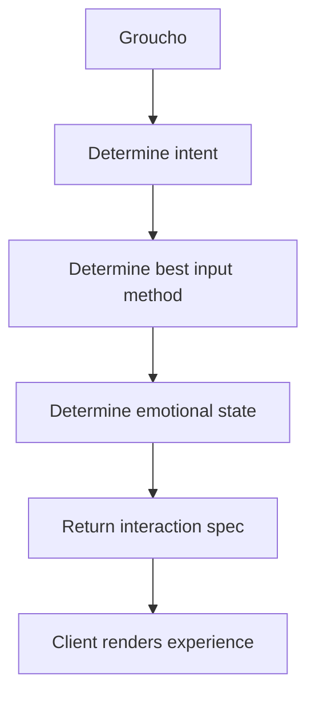
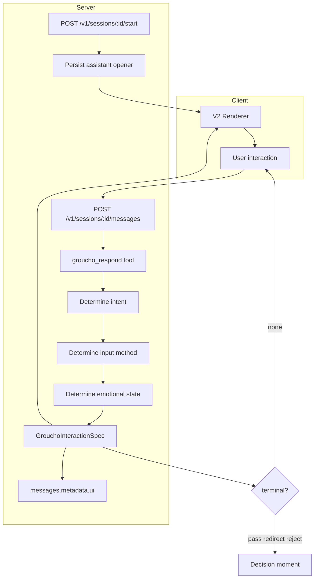

# Groucho V2 Roadmap

> **Decision-architecture note — 20 August 2026:** this document remains the
> reference for the gatekeeper interaction model, UI renderer, and visual presence.
> Its score-controlled `pass` / `redirect` / `reject` examples are superseded by
> [the stronger V1 implementation plan](./groucho-stronger-v1-implementation-plan.md),
> which separates advisory conversation completion from recorded human decisions
> and access authority.

Groucho V2 recenters the product around the gatekeeper experience.

Groucho is not a chatbot, form builder, or onboarding wizard. It is a selective conversational interface that protects the integrity of a community, identifies promising people, and helps surface who belongs in the room.

The primary experience should feel like a short encounter with a curator, A&R, or trusted cultural doorman. The goal is not to collect information. The goal is to make a decision.

## Product Boundary

### Primary

Gatekeeper projects are the main Groucho experience.

They should be:

- Adaptive.
- Selective.
- Calm.
- Visually embodied.
- Decision-oriented.
- Free of visible evaluation mechanics.

### Secondary

Onboarding projects remain useful after access is granted, or for structured intake flows where a fixed set of questions is truly required.

They should not drive the V2 interaction model.

The split is:

- `gatekeeper` - main user-facing Groucho experience.
- `onboarding` - structured post-access or operational intake.

## Current State

Today, gatekeeper sessions return a chat-style response:

```ts
{
  message: string
  status: "active" | "passed" | "redirected" | "rejected"
  scores: ScoreBreakdown
}
```

The structured gatekeeper tool currently returns:

```ts
{
  reply: string
  terminal: "none" | "pass" | "redirect" | "reject"
}
```

This is enough for a conversational API, but not enough for the V2 interface. The frontend cannot know whether to render text input, cards, ranking, voice, or a decision state.

## Target Experience

The user-facing hierarchy should be:

```text
Header
Groucho Presence
Question
Interaction
Subtle System Status
```

Avoid:

- Sidebars.
- Profile panels.
- Dashboard widgets.
- Progress counters.
- Visible scores.
- Visible criteria.
- "Application submitted" endings.

Prefer:

- One question at a time.
- Purpose-built inputs.
- Minimal copy.
- Motion-based state.
- Meaningful decision moments.

## V2 Architecture

Groucho is not a chat endpoint that returns text. Each turn is a server-side decision pipeline that produces an **interaction spec** for the client to render.



### Pipeline stages

| Stage | What Groucho decides | Drives |
| --- | --- | --- |
| **Intent** | What this turn is trying to do conversationally (probe, clarify, challenge, decide, etc.) | Copy tone, whether to ask or conclude |
| **Input method** | How the user should respond (`text`, `singleSelect`, `multiSelect`, etc.) | Which input component to mount |
| **Emotional state** | Groucho's posture toward the applicant this turn | Persona-consistent reply framing |
| **Interaction spec** | The full structured payload returned to the client | Renderer + dot matrix |
| **Client render** | Host app or SDK renders presence, question, and input | User-facing experience |

The model (via the gatekeeper structured tool) performs intent, input method, and emotional state selection in one pass. The API returns a single interaction spec; the client does not infer UI from free text alone.

## Interaction Spec Contract

Gatekeeper responses should become a UI-aware **interaction spec**, not just a message string.

```ts
type GrouchoIntent =
  | "probe"
  | "clarify"
  | "challenge"
  | "acknowledge"
  | "decide"
  | "redirect"
  | "reject"

type GrouchoInputType =
  | "text"
  | "voice"
  | "singleSelect"
  | "multiSelect"
  | "ranking"

type GrouchoEmotionalState =
  | "neutral"
  | "curious"
  | "interested"
  | "skeptical"
  | "evaluating"
  | "decisive"

type GrouchoVisualState =
  | "idle"
  | "listening"
  | "thinking"
  | "curious"
  | "interested"
  | "evaluating"
  | "decision"

type GrouchoInteractionSpec = {
  reply: string
  terminal: "none" | "pass" | "redirect" | "reject"
  intent: GrouchoIntent
  inputType: GrouchoInputType
  options?: string[]
  emotionalState: GrouchoEmotionalState
  visualState: GrouchoVisualState
}
```

### Field roles

- **`intent`** — what Groucho is trying to do this turn (e.g. probe for specificity, challenge a vague claim, acknowledge and move on).
- **`inputType`** — how the user should answer; drives the interaction component.
- **`emotionalState`** — Groucho's conversational posture; informs copy and persona consistency (not shown to users as a label).
- **`visualState`** — how the dot matrix and presence layer should animate; derived from emotional state and session phase.
- **`reply`** — the question or statement the user sees.
- **`terminal`** — whether the session continues or concludes (`pass`, `redirect`, `reject`).
- **`options`** — required when `inputType` is `singleSelect`, `multiSelect`, or `ranking`.

The frontend renders from the interaction spec. It does not guess input type or presence state from `reply` alone.

## API Shape

Future `POST /v1/sessions/{sessionId}/messages` responses should preserve existing fields while adding the interaction spec as UI metadata:

```json
{
  "message": "Two years is a long time.\n\nWhat's stopped you from releasing it?",
  "status": "active",
  "scores": {
    "specificity": 0.6,
    "authenticity": 0.7,
    "cultural_depth": 0.5,
    "overall": 0.62
  },
  "ui": {
    "intent": "probe",
    "inputType": "text",
    "emotionalState": "curious",
    "visualState": "curious"
  }
}
```

For structured inputs, `ui.options` is included when applicable. Scores remain in the API for operators, webhooks, and integrations, but user-facing components should not display them.

## Dot Matrix Presence

The dot matrix is Groucho's visual presence, not decoration.

It should communicate state through abstract motion:

- `idle` - slow breathing.
- `listening` - expansion and subtle wave movement.
- `thinking` - reorganizing patterns.
- `curious` - asymmetrical movement.
- `interested` - brighter and more active.
- `evaluating` - focused and geometric.
- `decision` - condensed and intentional.

The dot matrix should be the primary visual focus of the V2 screen.

## Interaction Types

### Text

Use when nuance matters:

- "Tell me about the track."
- "What are you trying to express?"
- "Why does this matter to you?"

### Single Select

Use when the answer is categorical:

```text
How long have you been releasing music?

[ Less than 1 Year ]
[ 1-3 Years ]
[ 3-5 Years ]
[ 5+ Years ]
```

### Multi Select

Use when multiple influences, contexts, or goals may apply:

```text
What are you hoping to find here?

[ Feedback ]
[ Community ]
[ Collaboration ]
[ Opportunity ]
```

### Ranking

Use when priority reveals taste or intent:

```text
Put these in order of importance.
```

### Voice

Use when emotional texture matters:

```text
Tell me about the idea in your own voice.
```

Voice can come later. The first V2 renderer should support text, single select, and multi select before ranking or audio.

## Conversation Style

Avoid:

```text
Thanks for your response.
```

```text
Question 4 of 12
```

```text
Your answer has been recorded.
```

Prefer:

```text
Interesting.
```

```text
Tell me more about that.
```

```text
What changed?
```

```text
Why this track?
```

```text
I'm trying to understand your process.
```

## Decision Experience

Do not end with generic submission copy.

The decision should be a moment:

```text
Groucho is considering your application...
```

Then the dot matrix enters `decision`.

Then Groucho speaks:

```text
Thank you.

I've heard enough.

Your application has been forwarded for review.
```

Or:

```text
Thank you.

I'd like to learn more before making a recommendation.
```

Terminal copy remains persona- and project-specific, but the interface should create a deliberate pause before it appears.

## Refactor Phases

### Phase 1 - Universal Start

Make Groucho always speak first.

Tasks:

- Make `POST /v1/sessions/{sessionId}/start` work for `gatekeeper` and `onboarding`.
- Persist the gatekeeper opening message as the first assistant message.
- Avoid duplicating that opener in model history.
- Add SDK `startSession`.
- Make the React `Gatekeeper` component bootstrap before enabling user input.

Why first:

- V2 depends on Groucho being the initiator.
- It makes host integrations consistent.
- It removes the "empty chat input" feeling.

### Phase 2 - Interaction Spec Contract

Extend the gatekeeper structured tool so each model turn returns a full interaction spec (intent, input method, emotional state, visual state).

Current:

```ts
{
  reply: string
  terminal: "none" | "pass" | "redirect" | "reject"
}
```

Target:

```ts
{
  reply: string
  terminal: "none" | "pass" | "redirect" | "reject"
  intent: "probe" | "clarify" | "challenge" | "acknowledge" | "decide" | "redirect" | "reject"
  inputType: "text" | "singleSelect" | "multiSelect" | "ranking" | "voice"
  options?: string[]
  emotionalState: "neutral" | "curious" | "interested" | "skeptical" | "evaluating" | "decisive"
  visualState: "listening" | "thinking" | "curious" | "interested" | "evaluating" | "decision"
}
```

Tasks:

- Update `lib/gatekeeper-structured-tool.ts` to require intent, inputType, emotionalState, and visualState.
- Update `lib/post-session-message.ts` parsing and response payload (`ui` object on API responses).
- Store the full interaction spec on assistant message metadata (`messages.metadata.interaction` or `messages.metadata.ui`).
- Add contract tests for intent/input/emotional/visual field validation.
- Update OpenAPI and SDK generated types.

Why this phase:

- Encodes the V2 architecture pipeline in the API.
- Unblocks the V2 renderer without the client inferring UI from text.

### Phase 3 - V2 Renderer

Create a user-facing renderer that is not a chat transcript.

Tasks:

- Add a single-column V2 experience.
- Put dot matrix presence above the question.
- Render only the current interaction spec (not a scrolling transcript).
- Hide scores and internal state.
- Support text, single select, and multi select first.
- Keep the existing transcript available only for admin/operator views.

Likely code areas:

- `app/doorcheck/page.tsx`
- `packages/sdk/src/react/Gatekeeper.tsx`
- SDK primitives under `packages/sdk/src/react/`

### Phase 4 - Decision Moment

Make terminal outcomes feel deliberate.

Tasks:

- Add `evaluating` and `decision` visual states.
- Delay terminal copy briefly after final input.
- Remove generic "application submitted" language from user-facing surfaces.
- Keep terminal status hidden unless a host app explicitly needs to show it.

### Phase 5 - Rich Inputs

Reduce typing by adding structured input components.

Order:

1. Single select.
2. Multi select.
3. Ranking.
4. Voice note.

Each input type should serialize back into a plain user message for the model and transcript, while preserving structured metadata for analytics and replay.

Example serialized user turn:

```json
{
  "role": "user",
  "content": "Selected: Feedback, Community",
  "metadata": {
    "inputType": "multiSelect",
    "selected": ["Feedback", "Community"]
  }
}
```

### Phase 6 - Admin Separation

Keep evaluation hidden from users but visible to operators.

Tasks:

- Ensure scores only appear in admin/operator views.
- Keep profile extraction and webhook payloads unchanged.
- Add a V2 session replay view that can show interaction spec metadata to operators.
- Keep raw model reasoning hidden.

## Architecture Sketch

End-to-end flow: universal start, interaction spec generation, client render loop.



## First Sprint Recommendation

Phase 1 (universal start) is the foundation. Next slice:

1. Interaction spec contract with only:
   - `intent: "probe" | "clarify" | "challenge" | "acknowledge" | "decide"`
   - `inputType: "text" | "singleSelect" | "multiSelect"`
   - `emotionalState: "neutral" | "curious" | "interested" | "evaluating" | "decisive"`
   - `visualState: "curious" | "thinking" | "evaluating" | "decision"`
2. V2 renderer behind a flag or new component name (`GatekeeperV2`).

Do not start with voice, ranking, or a full visual redesign. The main risk is the interaction spec contract and adaptive turn shape, not the animation polish.

## Open Product Decisions

- Should V2 replace the current SDK `Gatekeeper` component or ship as `GatekeeperV2` first?
- Should host apps be allowed to disable non-text input types per project?
- Should options be generated fully by the model, or selected from project-configured allowed option sets?
- Should terminal outcomes be user-visible, host-visible only, or project-configurable?
- How much of onboarding should remain in the product once V2 gatekeeper is the default?

## Success Criteria

A successful V2 Groucho session should feel like:

- A conversation with a curator.
- A brief encounter with a gatekeeper.
- An artist being genuinely listened to.

It should not feel like:

- A form.
- A chatbot.
- A SaaS onboarding flow.
- An application dashboard.

The user should leave believing someone paid attention to what they said, even though the evaluation is AI-driven.
